# Mermaid.js Class Diagram: The Unofficial Guide

This guide provides practical tips, styling tricks, and workarounds for common problems you'll encounter when building complex class diagrams in Mermaid.js. These are intended to supplement, not replace, the official documentation.

## 1. Taming the Layout Engine

Mermaid's layout is automatic, which is both a blessing and a curse. You cannot manually drag and drop classes. However, you can influence the layout.

### Influence Layout with Definition Order

The order in which you define relationships can influence the final layout. There's no fixed rule, but this is a good general strategy:

1. **Define main inheritance lines first**: Start with your primary A <|-- B inheritance trees.
2. **Define compositions/aggregations next**: Add your A *-- B and A o-- B relationships.
3. **Define associations/dependencies last**: Finish with simpler A --> B and A ..> B links.

This "top-down" definition can often help the dagre layout engine make more logical groupings.

## 2. Color usage

Do not use colors by default. If coloring is explicitly requested, use muted colors. You MUST use black text on light background, and white text on dark background.

## 3. Documenting Relationships: Labels and Cardinality

Professional class diagrams should clearly document the nature and multiplicity of relationships. While Mermaid doesn't require labels or cardinality, adding them significantly improves diagram readability and documentation value.

### When to Add Relationship Labels

Add a label when the relationship type isn't immediately obvious from the class names or relationship arrow alone.

**Good practice - labels add clarity:**
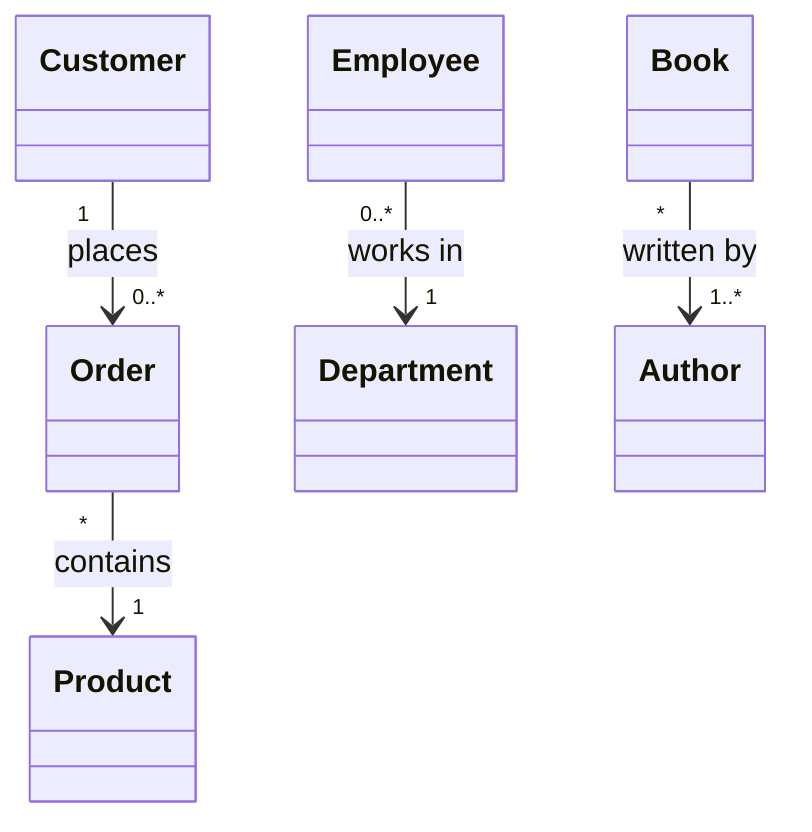

**Labels are less necessary when obvious:**
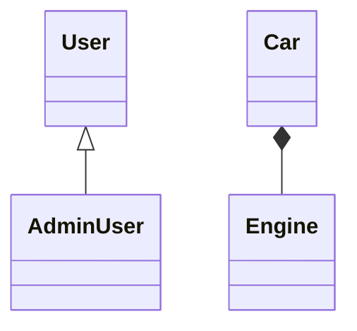

### When to Specify Cardinality

**Always specify cardinality except when:**
- Both sides are exactly "1" (though showing "1" -- "1" is clearer for documentation)
- The relationship is inheritance (`<|--`), realization (`..|>`), or dependency (`..>`), which don't typically have cardinality

**Common cardinality patterns:**

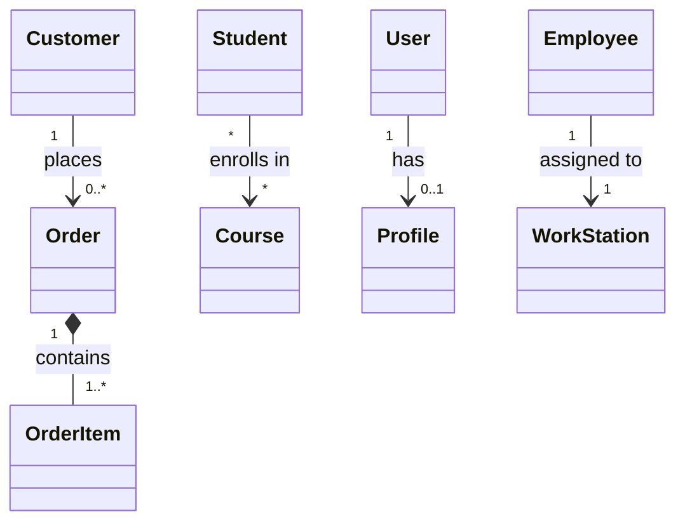

### Cardinality Reference

The following cardinality notations are supported:

- `1` - Exactly one (mandatory)
- `0..1` - Zero or one (optional)
- `1..*` - One or more (at least one required)
- `*` or `0..*` - Zero or more (fully optional)
- `n` - Exactly n instances (where n > 1)
- `0..n` - Zero to n instances (where n > 1)
- `1..n` - One to n instances (where n > 1)

### Reading Cardinality

Cardinality is read from the perspective of each class:

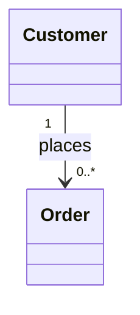

**Read as:**
- "Each Customer can place zero or more Orders"
- "Each Order is placed by exactly one Customer"

## 4. Attribute and Method Parameter Styles

Mermaid supports three styles for defining attributes and method parameters. **Use UML style unless the user specifies otherwise.**

### Attributes

**UML Style (Default):**
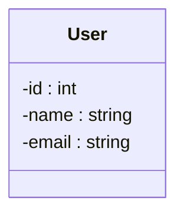

**Java/C# Style:**
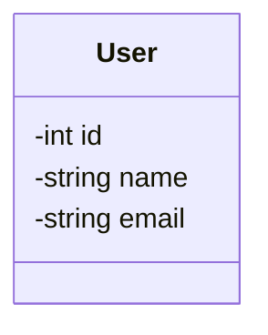

**Name Only:**
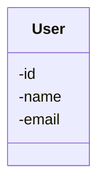

### Method Parameters

**UML Style (Default):**
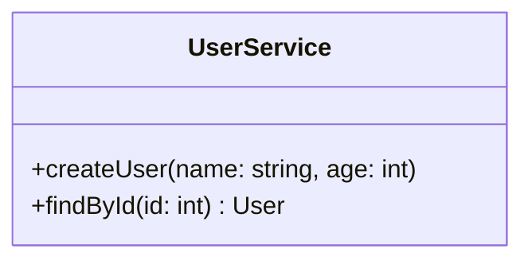

**Java/C# Style:**
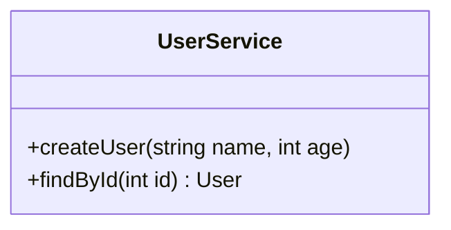

**Name Only:**
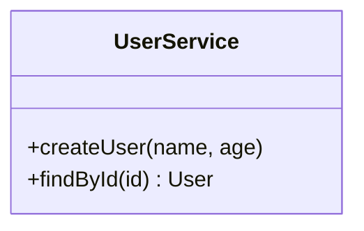

**Note:** For generic types in Java/C# style, use tilde notation: `List~User~ users`. For UML style with generics: `users : List~User~`.

## 5. Member Classifiers & Visibility

- Mark methods as static or abstract when appropriate

- Mark properties as static when appropriate

- Use the appropriate visibility prefix

### Quick Reference

**Visibility** (prefix - before member name):
- `+` Public
- `-` Private
- `#` Protected
- `~` Package/Internal

**Classifiers** (suffix - after method/field):
- `*` Abstract (methods only)
- `$` Static (methods and fields)


### Example

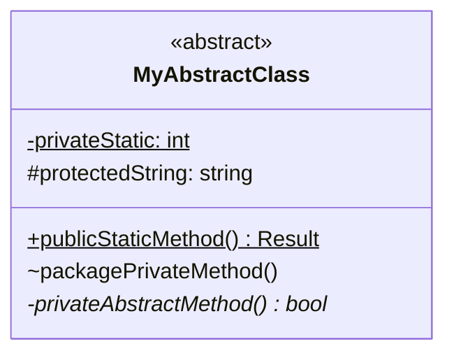

## 6. UML Constraints on Properties and Methods

UML supports constraint notation to add metadata about properties and methods. Constraints are typically shown in curly braces, such as `{readOnly}`, `{unique}`, or `{ordered}`.

To add UML constraints in Mermaid, use numeric entity codes to escape the curly braces:
- `#123;` for opening brace `{`
- `#125;` for closing brace `}`

**Example with Both Property and Method Constraints:**

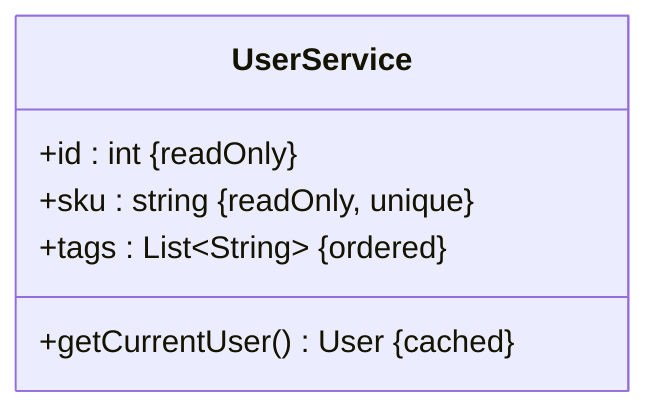

**Custom Constraint Example:**

You can also define custom constraints:

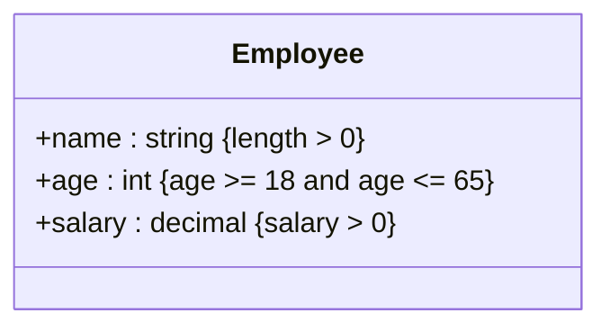

**Typical UML Constraints:**
- `{readOnly}` - Property cannot be modified after initialization. Use sparingly, only to highlight immutability where necessary.
- `{unique}` - Each instance must have a unique value
- `{ordered}` - Collection maintains insertion order
- `{id}` - Part of object's unique identifier. Use only when the identifier consists of multiple attributes.

## 7. Syntax Traps & Critical Workarounds

These are the most common "gotchas" that break diagrams and are not immediately obvious.

### Trap: Generics with Angle Brackets (e.g., List<T>)

**Problem**: Mermaid can confuse the < and > characters with HTML tags, especially when rendered in a browser.

**Solution**: Choose the right syntax based on whether you have nested generics:

#### For Simple Generics (One Level)

Use tilde notation `~` to wrap type parameters. Commas do not need escaping.

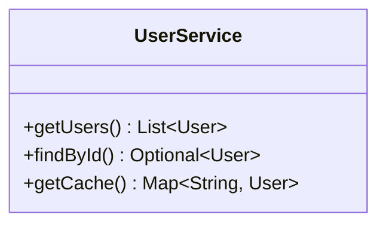

#### For Nested Generics (Two or More Levels)

Use HTML entities `&lt;` and `&gt;` instead of angle brackets. This is required when generics are nested inside other generics.

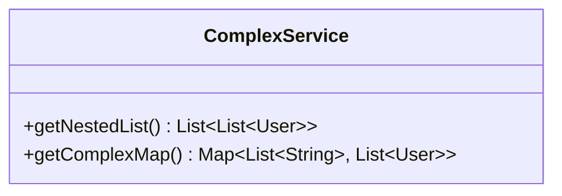

**Quick Decision Rule**:
- One level? → Use tildes: `List~User~`, `Map~String, User~`ja
- Nested? → Use HTML entities: `List&lt;List&lt;User&gt;&gt;`


### Trap: UML Constraints with Curly Braces (e.g., {readOnly})

**Problem**: Curly braces `{` and `}` are special characters in Mermaid and cannot be used directly in property or method definitions. This breaks standard UML constraint notation like `{readOnly}`, `{unique}`, or `{ordered}`.

**Solution**: Use Mermaid's numeric entity code syntax to escape the curly braces:
- `#123;` for opening brace `{`
- `#125;` for closing brace `}`

This allows you to add UML constraints to properties and methods:

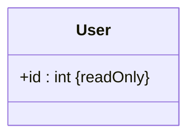

### Trap: Reserved Words and Special Characters

**Problem**: Using class names, methods, or labels with spaces, reserved words (like `end`), or special characters (like `-`) will break the parser.

**Workaround**: Always enclose them in back ticks (`` ` ``).

```mermaid
classDiagram
class `User Service` {
    +get-user-data()
}
`User Service` --> Order

namespace `Order.Domain/Entities` {
    class Order {
        +calculateTotal()
    }
}
```