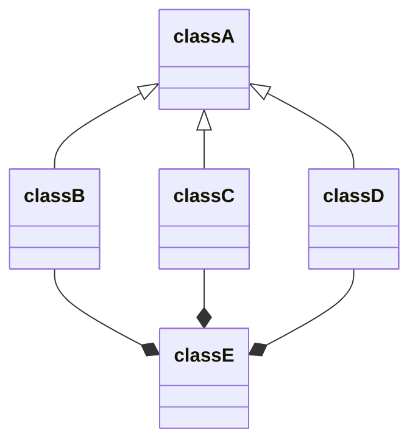
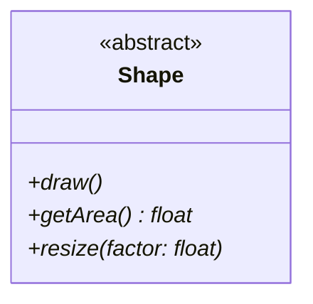
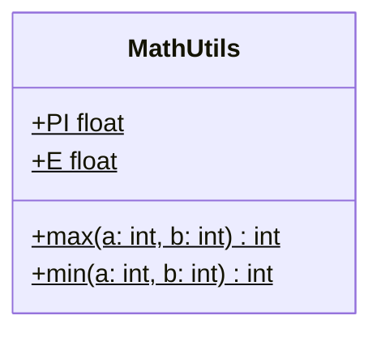
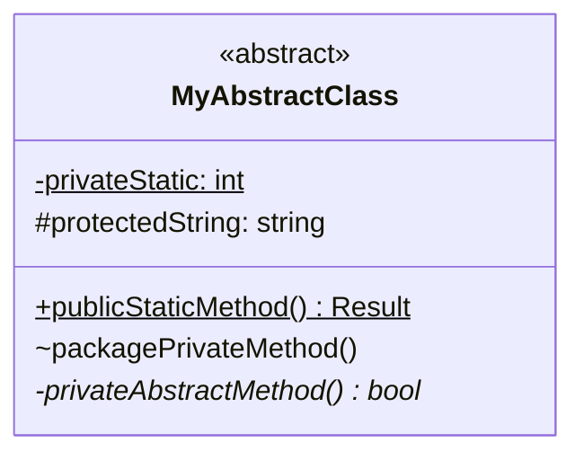
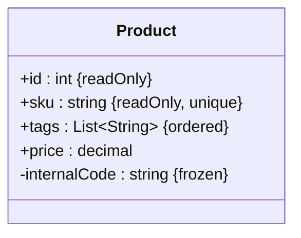
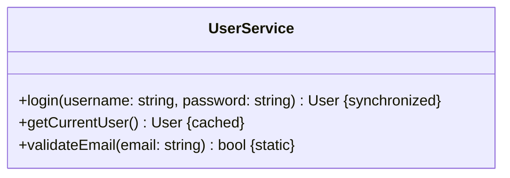
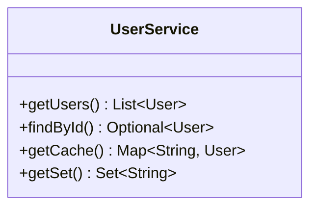
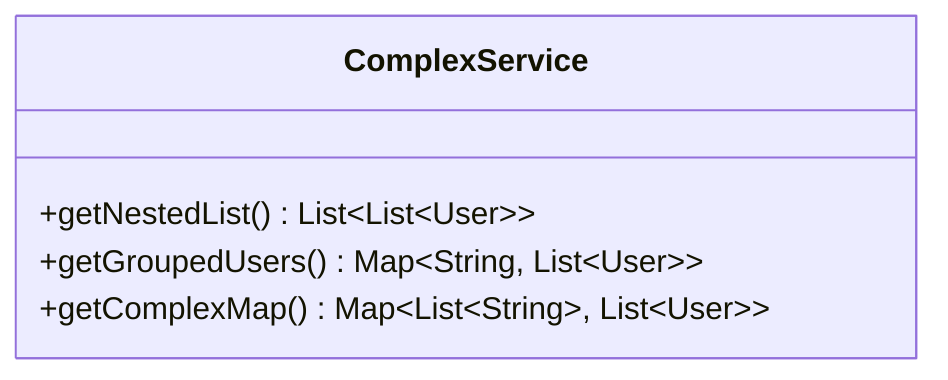
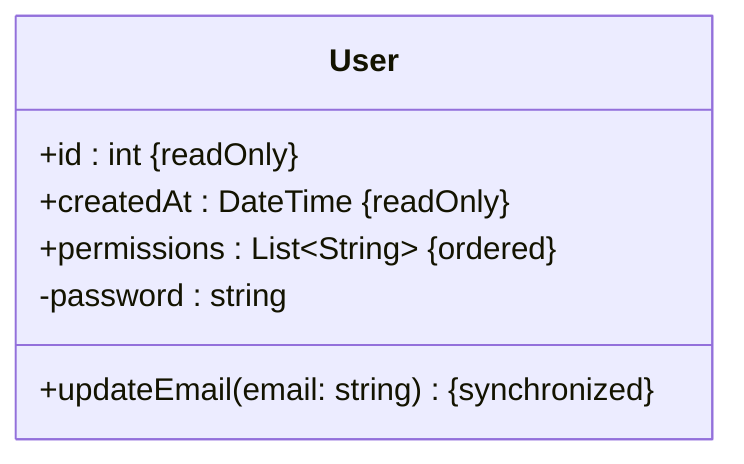

# Mermaid.js Class Diagram: The Unofficial Guide

This guide provides practical tips, styling tricks, and workarounds for common problems you'll encounter when building complex class diagrams in Mermaid.js. These are intended to supplement, not replace, the official documentation.

## 1. Taming the Layout Engine

Mermaid's layout is automatic, which is both a blessing and a curse. You cannot manually drag and drop classes. However, you can influence the layout.

### Try Experimental Layout Engines

The default layout engine is dagre. For complex or "many-to-many" relationships, dagre can create a mess. You can specify a different engine using a configuration directive at the top of your diagram.

- **elk**: Often produces cleaner, more organized layouts, especially for larger diagrams.
- **cose-bilkent**: A force-directed layout that can be excellent for visualizing networks and complex inter-relationships.



### Influence Layout with Definition Order

The order in which you define relationships can influence the final layout. There's no fixed rule, but this is a good general strategy:

1. **Define main inheritance lines first**: Start with your primary A <|-- B inheritance trees.
2. **Define compositions/aggregations next**: Add your A *-- B and A o-- B relationships.
3. **Define associations/dependencies last**: Finish with simpler A --> B and A ..> B links.

This "top-down" definition can often help the dagre layout engine make more logical groupings.

## 2. Advanced Styling with classDef

Mermaid does not automatically style stereotypes like <<abstract>> or <<interface>>. You must simulate this manually using classDef.

### Simulate Abstract Classes and Interfaces

The standard UML practice is to show abstract class names in italics and interface names with a stereotype. You can create classDef styles for these and apply them.

- **font-style: italic** for abstract classes.
- **font-weight: bold** for interfaces (a common convention).

Here is a practical example:

```mermaid
classDiagram
%% Define the styles
classDef abstract font-style:italic
classDef interface font-weight:bold,color:#008000

class IStorage {
    <<interface>>
    +save(data)
    +load(id)
}

class BaseStorage {
    <<abstract>>
    #connectionString
    +load(id)*
}

class S3Storage {
    +save(data)
    +load(id)
}

class LocalStorage {
    +save(data)
    +load(id)
}

%% Apply the styles
class IStorage:::interface
class BaseStorage:::abstract

BaseStorage <|.. IStorage
S3Storage --|> BaseStorage
LocalStorage --|> BaseStorage
```

### Known-to-Work CSS Properties

The documentation is light on which CSS properties are supported. These are known to work reliably with classDef:

- **fill**: The background color of the class box.
- **color**: The text color.
- **stroke**: The border color.
- **stroke-width**: The border thickness.
- **font-style**: (e.g., italic)
- **font-weight**: (e.g., bold)

## 3. Attribute and Method Parameter Styles

Mermaid supports three styles for defining attributes and method parameters. **Use UML style unless the user specifies otherwise.**

### Attributes

**UML Style (Default):**
```mermaid
class User {
    -id : int
    -name : string
    -email : string
}
```

**Java/C# Style:**
```mermaid
class User {
    -int id
    -string name
    -string email
}
```

**Name Only:**
```mermaid
class User {
    -id
    -name
    -email
}
```

### Method Parameters

**UML Style (Default):**
```mermaid
class UserService {
    +createUser(name: string, age: int)
    +findById(id: int) User
}
```

**Java/C# Style:**
```mermaid
class UserService {
    +createUser(string name, int age)
    +findById(int id) User
}
```

**Name Only:**
```mermaid
class UserService {
    +createUser(name, age)
    +findById(id) User
}
```

**Note:** For generic types in Java/C# style, use tilde notation: `List~User~ users`. For UML style with generics: `users : List~User~`.

## 4. Member Classifiers & Visibility

- Mark methods as static or abstract when appropriate

- Mark properties as static when appropriate

- Use the appropriate visibility prefix

### Quick Reference

**Visibility** (prefix - before member name):
- `+` Public
- `-` Private
- `#` Protected
- `~` Package/Internal

**Classifiers** (suffix - after method/field):
- `*` Abstract (methods only)
- `$` Static (methods and fields)

### Abstract Methods



### Static Members



### Combining Visibility and Classifiers



## 5. UML Constraints on Properties and Methods

UML supports constraint notation to add metadata about properties and methods. Constraints are typically shown in curly braces, such as `{readOnly}`, `{unique}`, or `{ordered}`.

### Adding Constraints to Properties

To add UML constraints in Mermaid, use numeric entity codes to escape the curly braces:
- `#123;` for opening brace `{`
- `#125;` for closing brace `}`

**Common Constraint Examples:**



**Standard UML Constraints:**
- `{readOnly}` - Property cannot be modified after initialization
- `{unique}` - Each instance must have a unique value
- `{ordered}` - Collection maintains insertion order
- `{frozen}` - Value cannot change after object creation
- `{derived}` - Value is calculated from other properties

### Adding Constraints to Methods

Constraints can also be applied to methods:



## 6. Syntax Traps & Critical Workarounds

These are the most common "gotchas" that break diagrams and are not immediately obvious.

### Trap: Generics with Angle Brackets (e.g., List<T>)

**Problem**: Mermaid can confuse the < and > characters with HTML tags, especially when rendered in a browser.

**Solution**: Choose the right syntax based on whether you have nested generics:

#### For Simple Generics (One Level)

Use tilde notation `~` to wrap type parameters. Commas do not need escaping.



#### For Nested Generics (Two or More Levels)

Use HTML entities `&lt;` and `&gt;` instead of angle brackets. This is required when generics are nested inside other generics.



**Quick Decision Rule**:
- One level? → Use tildes: `List~User~`, `Map~String, User~`
- Nested? → Use HTML entities: `List&lt;List&lt;User&gt;&gt;`

### Trap: Namespaces with Relationships

**Problem**: There is a known bug in many Mermaid versions where classes defined in a namespace will appear empty (losing their methods and attributes) if you define a relationship to them after the namespace block.

**Workaround**: Define all relationships inside the namespace block.

```mermaid
classDiagram
%% SAFE METHOD:
namespace Core {
    class User
    class Order {
        +userId
    }
    %% Define relationships INSIDE the namespace
    User "1" -- "0..*" Order : places
}

%% BUGGY METHOD (Avoid This):
namespace Core {
    class User
    class Order {
        +userId
    }
}
%% This relationship may cause User and Order
%% to render as empty boxes
Core.User "1" -- "0..*" Core.Order : places
```

### Trap: UML Constraints with Curly Braces (e.g., {readOnly})

**Problem**: Curly braces `{` and `}` are special characters in Mermaid and cannot be used directly in property or method definitions. This breaks standard UML constraint notation like `{readOnly}`, `{unique}`, or `{ordered}`.

**Solution**: Use Mermaid's numeric entity code syntax to escape the curly braces:
- `#123;` for opening brace `{`
- `#125;` for closing brace `}`

This allows you to add UML constraints to properties and methods:



### Trap: Reserved Words and Special Characters

**Problem**: Using class names, methods, or labels with spaces, reserved words (like `end`), or special characters (like `-`) will break the parser.

**Workaround**: Always enclose them in double quotes (`"`).

```mermaid
classDiagram
class "User Service" {
    +get-user-data()
}
"User Service" --> "Order"

class "Order" {
    +calculateTotal()
}
```
