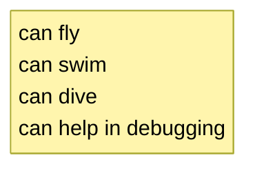
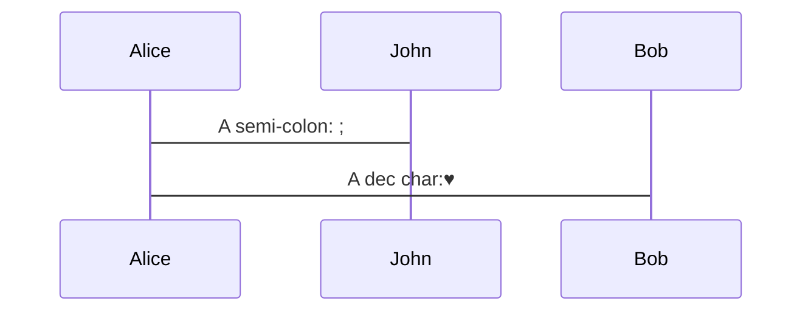
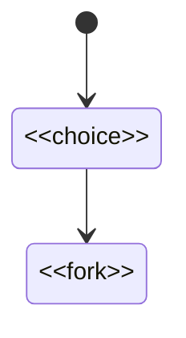

# General Guidelines for creating mermaid.js diagrams

## Line Breaks

### General Syntax

The method for creating line breaks varies by diagram type:

#### Most Diagram Types (Recommended)
Use `<br>` or `<br/>` tags for line breaks in text labels, notes, and descriptions.



## HTML Escaping and Special Characters

### Entity Code Escaping

Mermaid supports numeric entity codes for escaping special characters that might conflict with diagram syntax.

#### Syntax
```
#decimal_number;
```

#### Common Examples
| Character | Entity Code | Description |
|-----------|-------------|-------------|
| `"` | `#quot;` | Double quote |
| ♥ | `#9829;` | Heart symbol |
| # | `#35;` | Hash symbol |
| ∞ | `#infin;` | Infinity symbol |
| ; | `#59;` | Semicolon (since semicolons are used for line breaks) |

#### Usage Examples


### Standard HTML Entities

Some diagrams also support standard HTML entities:

| Entity | Character | Usage |
|--------|-----------|-------|
| `&lt;` | `<` | Less than |
| `&gt;` | `>` | Greater than |
| `&amp;` | `&` | Ampersand |

#### Example in State Diagrams


---

## Colors

When selecting colors, ALWWAYS make sure text is dark if background is light, and text is light if background is dark. For example, if you have selected a light peach as the color for a diagram element, make sure that the text written in that diagram element is dark (black/close to black).

Example of dark text on light background styling:

```
    style API fill:#C8E6C9,color:#000000
    style Application fill:#FFCCCC,color:#000000
    style Core fill:#FFFACD,color:#000000
    style Infrastructure fill:#B3E5FC,color:#000000
```


## Syntax guidance

When possible - and not otherwise adviced by the user / context - use UML syntax.