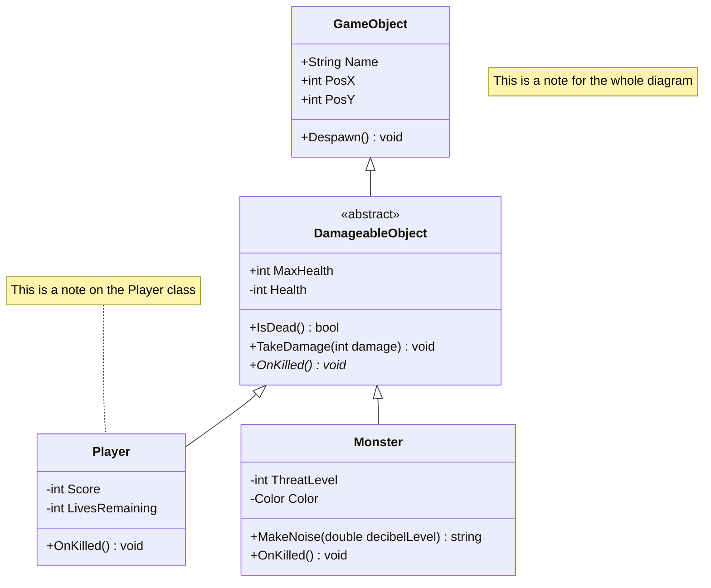

```mermaid
classDiagram
    note "This is a note for the whole diagram"
    note for Player "This is a note on the Player class"
    class GameObject {
        +String Name
        +int PosX
        +int PosY
        +Despawn() void
    }
    class DamageableObject {
        <<abstract>>
        +int MaxHealth
        -int Health
        +IsDead() bool
        +TakeDamage(int damage) void
        +OnKilled()* void
    }
    class Player {
        -int Score
        -int LivesRemaining
        +OnKilled() void
    }
    class Monster {
        -int ThreatLevel
        -Color Color
        +MakeNoise(double decibelLevel) string
        +OnKilled() void
    }
    GameObject <|-- DamageableObject
    DamageableObject <|-- Player
    DamageableObject <|-- Monster
```