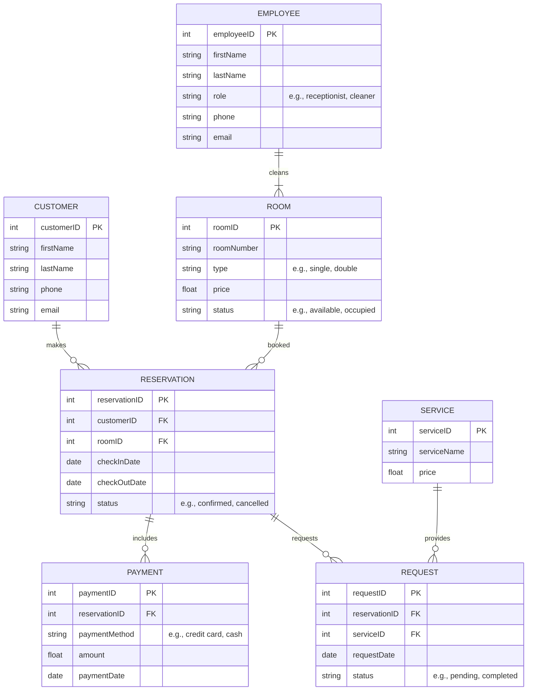

# Entity-Relationship Diagram Examples

```mermaid
erDiagram
    EMPLOYEE ||--|{ ROOM : cleans
    EMPLOYEE {
        int employeeID PK
        string firstName
        string lastName
        string role "e.g., receptionist, cleaner"
        string phone
        string email
    }

    CUSTOMER ||--o{ RESERVATION : makes
    CUSTOMER {
        int customerID PK
        string firstName
        string lastName
        string phone
        string email
    }

    ROOM ||--o{ RESERVATION : booked
    ROOM {
        int roomID PK
        string roomNumber
        string type "e.g., single, double"
        float price
        string status "e.g., available, occupied" 
    }

    RESERVATION ||--o{ PAYMENT : includes
    RESERVATION ||--o{ REQUEST : requests
    RESERVATION {
        int reservationID PK
        int customerID FK
        int roomID FK
        date checkInDate
        date checkOutDate
        string status "e.g., confirmed, cancelled"
    }

    PAYMENT {
        int paymentID PK
        int reservationID FK
        string paymentMethod "e.g., credit card, cash"
        float amount
        date paymentDate
    }

    REQUEST {
        int requestID PK
        int reservationID FK
        int serviceID FK
        date requestDate
        string status "e.g., pending, completed"
    }

    SERVICE ||--o{ REQUEST : provides
    SERVICE {
        int serviceID PK
        string serviceName
        float price
    }
```