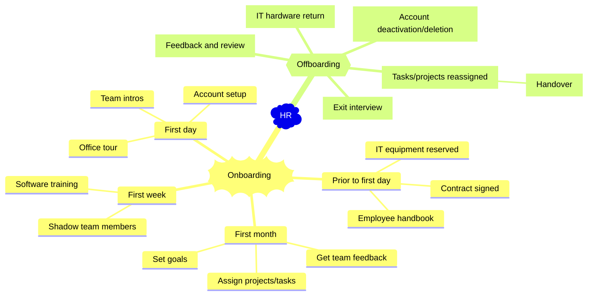

# Mind Map Examples

```mermaid
mindmap
  root)HR(
    ))Onboarding((
      Prior to first day
        Contract signed
        Employee handbook
        IT equipment reserved
      First day
        Office tour
        Team intros
        Account setup
      First week
        Shadow team members
        Software training
      First month
        Assign projects/tasks
        Set goals
        Get team feedback

    id2{{Offboarding}}
      [Feedback and review]
      [Exit interview]
      [Tasks/projects reassigned]
        [Handover]
      [Account deactivation/deletion]
      [IT hardware return]

```