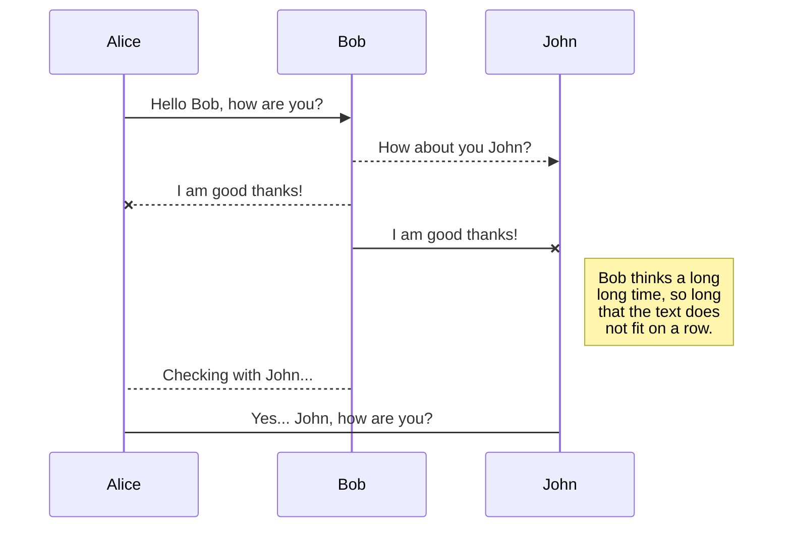
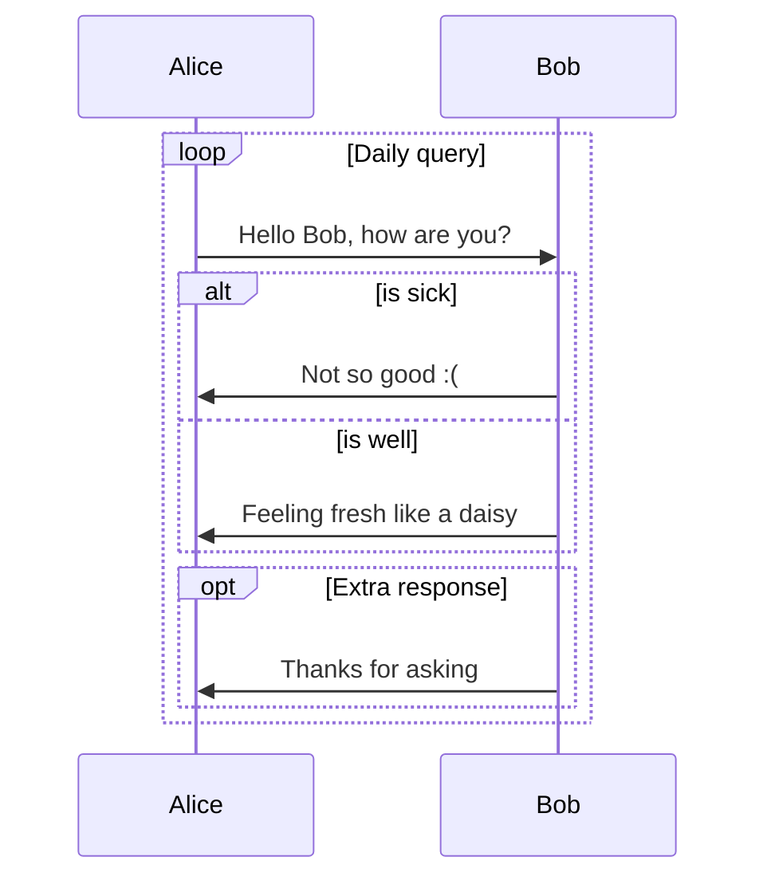
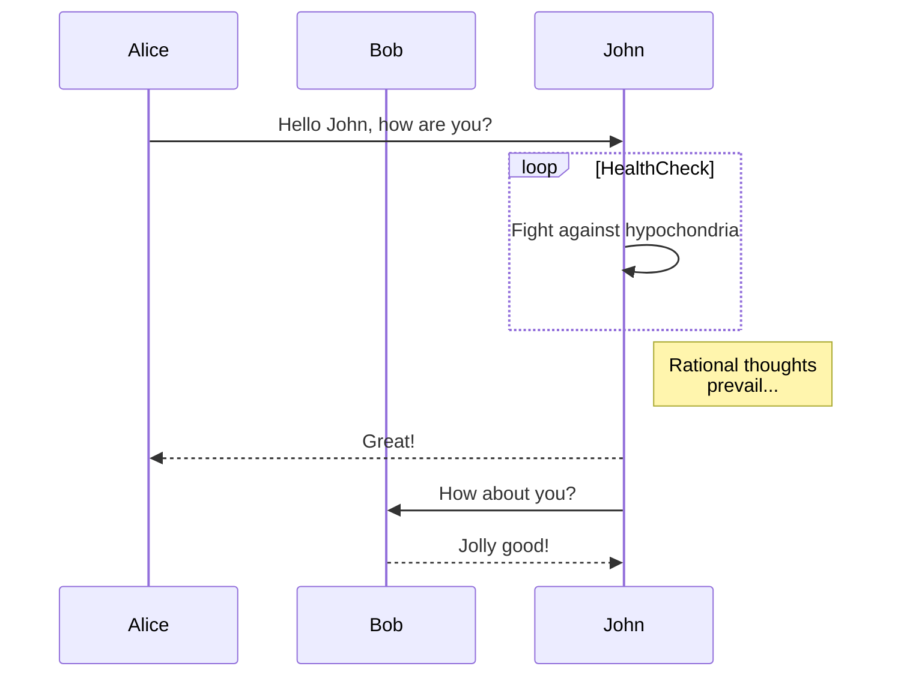
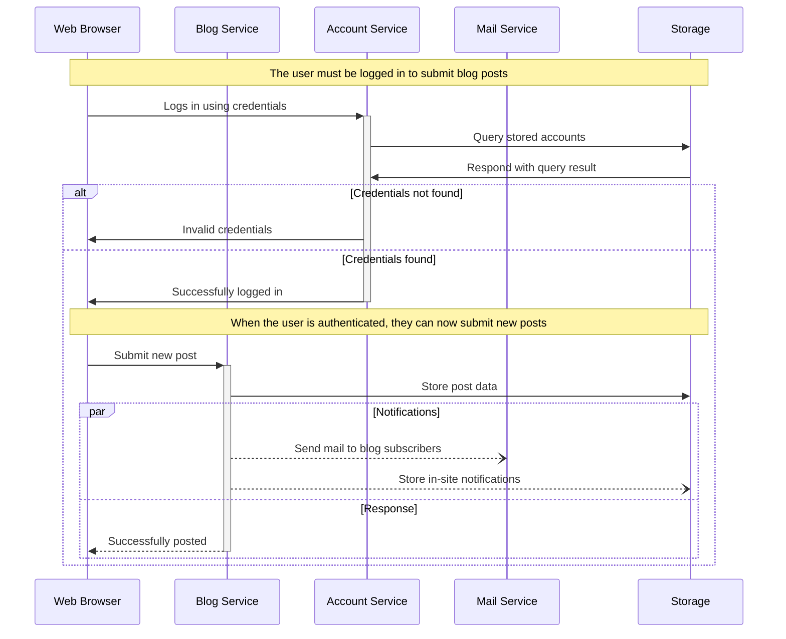

# Sequence Diagram Examples

## Basic sequence diagram

## SequenceDiagram: Loops, alt and opt

## SequenceDiagram: Message to self in loop

## Sequence Diagram: Blogging app service communication

