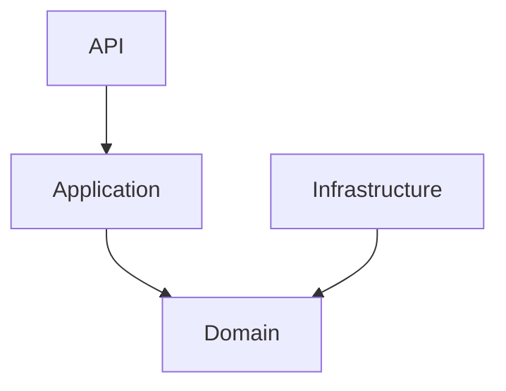

# Software Architecture & Design

Diagrams for modeling system structure, component relationships, and technical design patterns.

## Class Diagrams (`classDiagram`)

- Modeling object-oriented design and class structures
- Documenting inheritance hierarchies and polymorphism
- Showing class relationships (associations, compositions, aggregations)
- Designing API structures and interfaces
- Illustrating design patterns and their implementations

## Sequence Diagrams (`sequenceDiagram`)

- Documenting API interactions and message flows
- Illustrating object interactions over time
- Showing asynchronous and synchronous communication
- Designing authentication and authorization flows
- Mapping distributed system interactions

## State Diagrams (`stateDiagram-v2`)

- Modeling object or system lifecycle states
- Documenting state machines and transitions
- Illustrating order processing or workflow status
- Designing UI state management
- Showing protocol state transitions

## Flowcharts (`flowchart`)

- Documenting business processes and workflows
- Illustrating algorithm logic and control flow
- Creating decision trees for troubleshooting or logic
- Designing conditional logic and branching scenarios

## Graphs (`graph`)

- Simple box-and-arrow drawings with boxes (or other shapes) and arrows.

### Example

## Architecture Diagrams (`architecture-beta`)

This diagram type is in beta testing. DO NOT USE unless explicitly requested by user.

- Visualizing system architecture and infrastructure layout
- Documenting cloud or on-premises infrastructure design
- Showing relationships between services, databases, and components
- Illustrating deployment topologies and network architecture
- Designing microservices architectures

## Block Diagrams (`block`)

DO NOT USE unless explicitly requested by user.

- Documenting hardware and software block interactions
- Showing logical groupings of functionality

## C4 Diagrams (`c4Diagram`)

This diagram type is experimental. DO NOT USE unless explicitly requested by user.

- Documenting software architecture at multiple levels of abstraction
- Creating context diagrams to show system boundaries and external actors
- Designing container diagrams for deployment architecture
- Detailing component diagrams for internal structure
- Providing code-level diagrams for class/module relationships

## ZenUML Sequence Diagrams (`zenuml`)

- Alternative syntax for sequence diagrams with cleaner notation
- Documenting API interactions with simplified syntax
- Showing message flows with more concise code
- Creating sequence diagrams when preferring ZenUML style
- Illustrating collaboration between objects or systems
